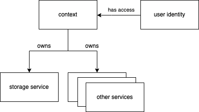

# Context

Every entity inside DTZ needs to have a parent context. This represents the organizational structure to hold an entity, allow access control, and provides accounting and billing.

A context can be created through the main page.



